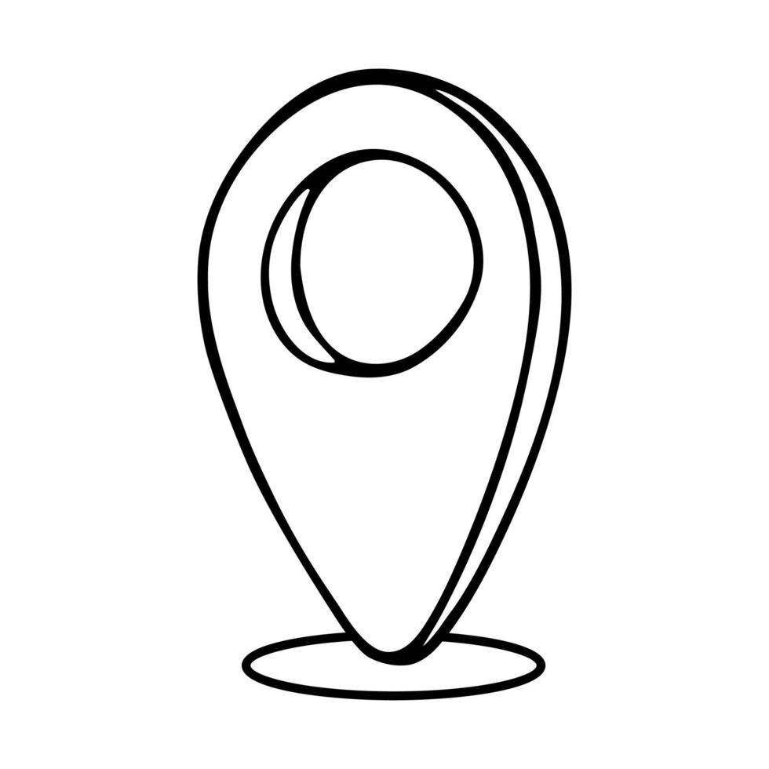
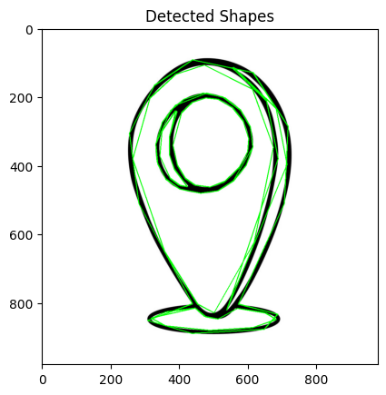

# Curvetopia: Shape Detection and Regularization

Curvetopia is a project focused on identifying and regularizing geometric shapes from hand-drawn doodles. Using image processing techniques, the project simplifies curves and classifies them into various geometric shapes such as lines, circles, ellipses, rectangles, polygons, and stars.

## Features

- **Curve Regularization**: Simplifies curves for easier shape analysis.
- **Shape Identification**: Detects and classifies shapes including lines, circles, ellipses, rectangles, polygons, and stars.
- **Ellipse Fitting**: Differentiates between circles and ellipses based on aspect ratio.

## Input Image


## Output Image


## Installation

To run this project, you'll need Python and the following packages:

- opencv-python
- numpy
- matplotlib

Install the required packages using pip:

```bash
pip install opencv-python numpy matplotlib

Install the required packages using pip:

```bash
pip install opencv-python numpy matplotlib
